### Dans cette vidéo, nous allons apprendre comment Envoyer un mail à GMAIL via notre application

Sur votre barrse url, entrez http://console.cloud.google.com/
Vous serez envoyé ici, puis cliquer sur le bouton encerclé en rouge
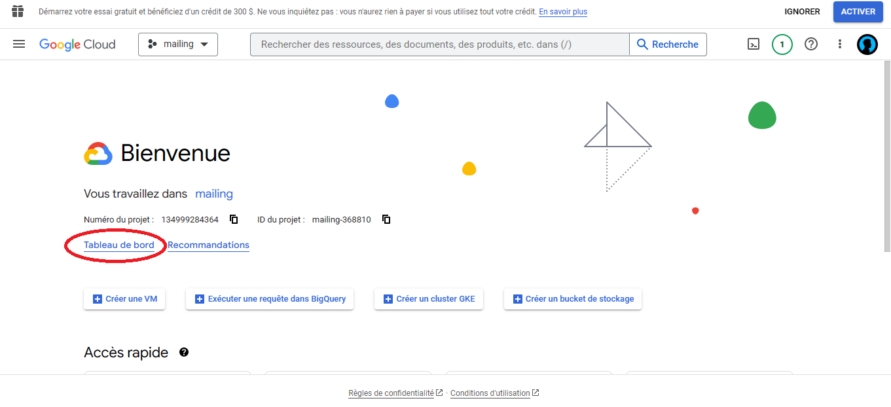

Normalement après voir cliqué, vous serez redirigé vers

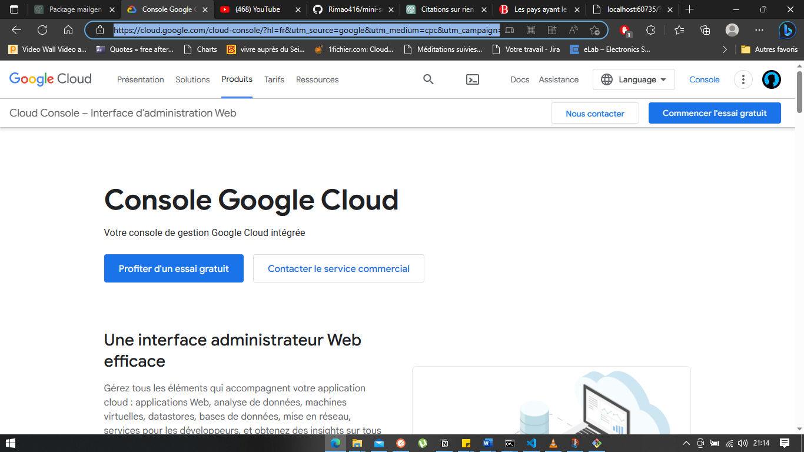

Ensuite, encore cliquer sur le bouton encerclé en rouge, et vous serez redirigé sur

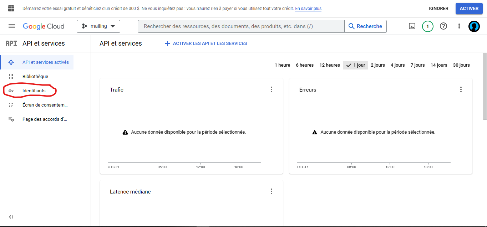

Encore cliquer sur le bouton encerclé en route, et vous serez redirigé vers

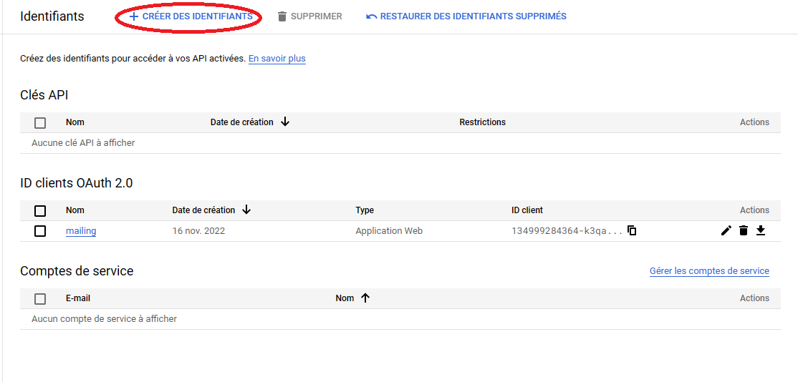

Ensuite cliquer sur l'icone en rouge, un menu déroulant va s'afficher, puis cliquer sur l'icone en rouge

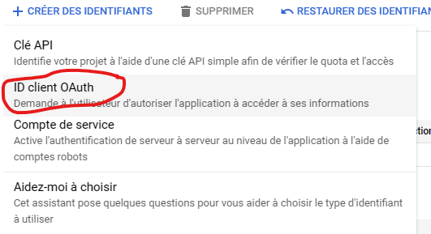

A ce stade, vous êtes sur le point de choisir le type d'application comme l'indique l'interface ci-dessou
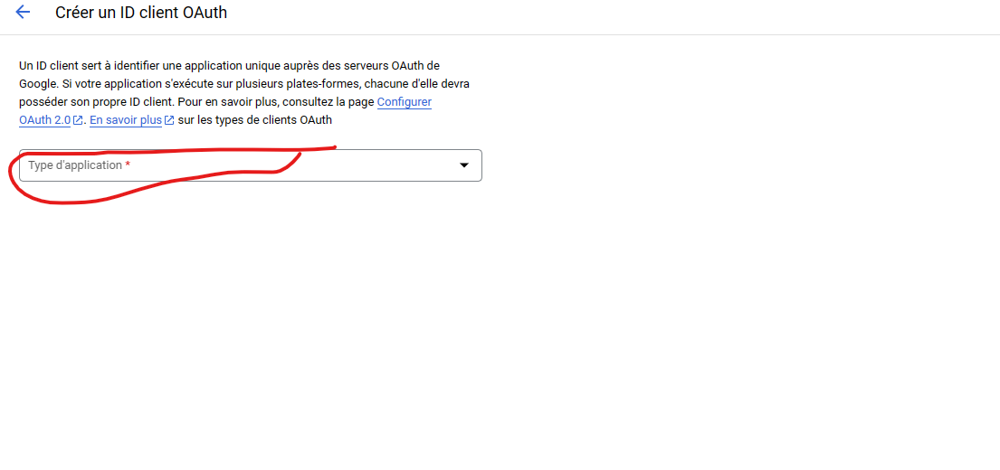


Cliquer sur le menu déroulant et choisissez votre application comme le montre l'interface ci-dessous
Dans notre cas, c'est une application Web

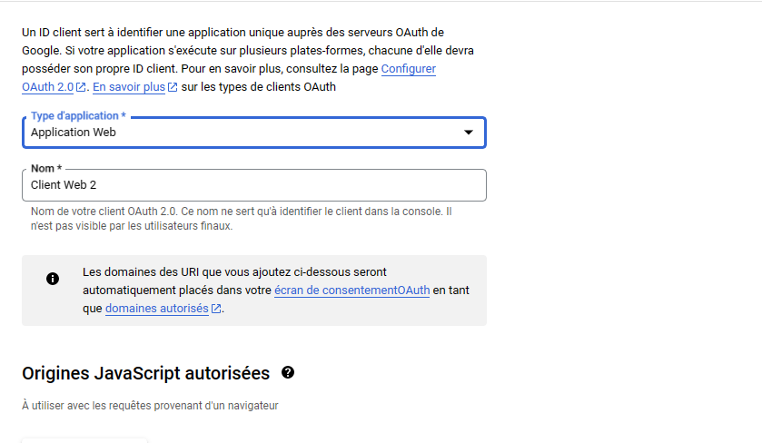

Puis vers le bas, vous cliquez sur CREER, et là un modal va s'afficher, 
ce modal contient votre clé publique et secrète comme le montre l'interface ci-dessous

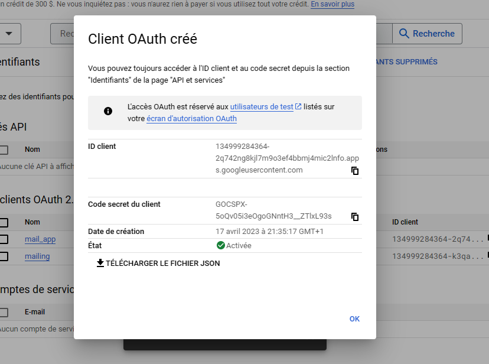

Copier cela et insérez ça dans votre code


**OAuth 2.0 Playground**
___Après avoir inseré notre API, nous devons faire une deuxième étape___

Allez sur Google et taper ***Google oauth playground*** ou vous pouvez juste entrer ce lien sur la barre de recherche https://developers.google.com/oauthplayground/

Normalement vous serez ci-dessous 

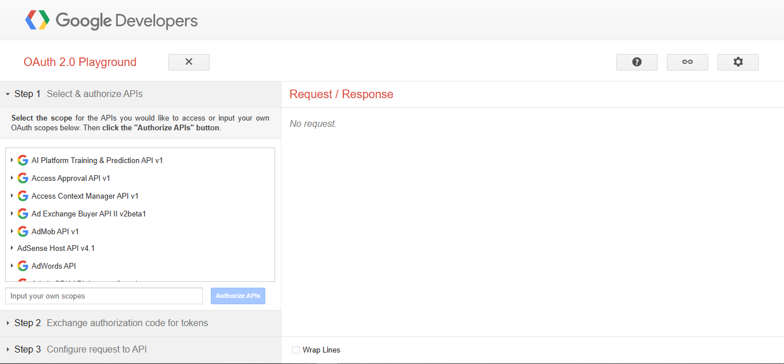

Dans cette interface, il y'a une section ***select the scope***, scroller vers le bas, jusqu'à tomber sur ***Gmail Api V1*** comme l'indique l'interface ci-dessous
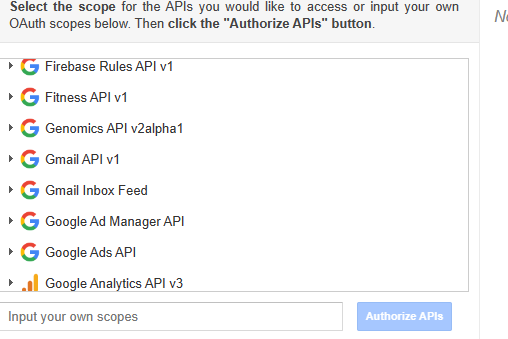

Cliquez sur ***Gmail Api V1***, puis ***https://mail.google.com/*** comme l'indique l'interface ci-dessous
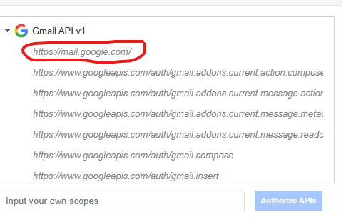

En cliquant le button ***Authorize APIS*** qui était bloqué va se débloquer.
Cliquez dessus
Vous serez renvoyez vers une interface de connexion


Et après avoir choisi votre compte de connexion, vous serez renvoyer vers l'interface ci-dessous 
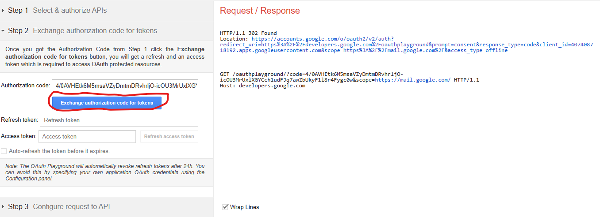

Puis cliquez sur le bouton encerclé en rouge pour generer vos token, et vous obtiendrez ça
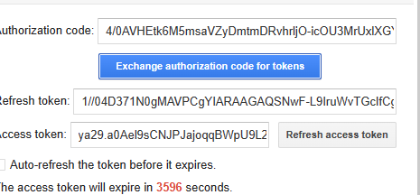

**NOTEZ QUE CE TOKEN NE VALIDE QUE PENDANT UNE HEURE ET FAUDRA CONSTAMMENT LE RAFRAICHIR**


**Notre fichier HTML crée est vraiment particulier, alors pour qu'il communique avec le NodeJs, il ne faut pas l'ouvrir comme tout fichier, mais faut l'ouvrir avec le PORT de notre application**
Dans notre cas, c'est ***localhost:3000/***


Le code initial est ```const nodemailer = require("nodemailer");
const express = require("express");
const path = require("path");
const multer = require("multer");

const app = express(express.static(path.join(__dirname + "public/uploads")));
var storage = multer.diskStorage({
  destination: (req, file, cb) => {
    cb(null, "public/uploads");
  },
  filename: (req, file, cb) => {
    cb(null, Date.now() + path.extname(file.originalname));
  },
});
var upload = multer({ storage: storage }).array('file',100);


app.use(express.json());
app.use(express.urlencoded({ extended: true }));

app.get("/", (req, res) => {
  res.sendFile(__dirname + "/index.html");
});

app.post("/sendemail", (req, res) => { 
    console.log("Ressui");
  upload(req, res, (err) => {
    if (err) {
      console.log("Eroor");
      return;
    } else {
        console.log(req.files)
    }
  });
});
app.listen(3000, () => {
  console.log("Server is running on port 3000");
});

const CLIENT_ID =
  "134999284364-2q742ng8kjl7m9o3ef4bbmj4mic2lnfo.apps.googleusercontent.com";
const CLIENT_SECRET = "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";
async function sendEmail() {
  try {
    const transport = nodemailer.createTransport({
      service: "gmail",
      //   host: "smtp.gmail.com",
      //   port: 587,
      //   secure: false,
      auth: {
        type: "OAuth2",
        user: "omarkayumba12345@gmail.com",
        clientId: CLIENT_ID,
        clientSecret: CLIENT_SECRET,
        accessToken:
          "ya29.a0Ael9sCNJPJajoqqBWpU9L2oTBtAZdo_5GgySzyLDSXwCAAXO3X2xr0MiHKdG7s6KyVZhsHJeb6tDVaKUZX95NU5pdtGglqAEReoJYl5V5j2ePVt4iAdOAZoGyOkP8sO3ZxwfJ2HMe2t7HyJkoxNnWxbNhNxPaCgYKAa8SARISFQF4udJh9Dq28ELrU1-T7xr8Tt6gKw0163",
      },
    });
    const mailOptions = {
      from: "omarkayumba12345@gmail.com",
      to: "omarkayumba2017@gmail.com",
      subject: "Ceci est le début de quelque chose de très grande",
      text: "Je ne suis que l'ombre de ce que tu vois",
      html: "<h1>Bonjour Omari, Tu viens de réussir à envoyer ton premier mail avec Google, felicitation mon gars</h1> ",
      attachments: [
        {
          filename: "file.txt",
          content: "Lorem ipsum dolor set amet",
        },
      ],
    };
    const result = await transport.sendMail(mailOptions);
    return result;
  } catch (err) {
    console.log(err);
  }
}

sendEmail()
  .then((result) => {
    console.log("Message sent:");
  })
  .catch((error) => {
    console.log("Error: %s");
  });
```