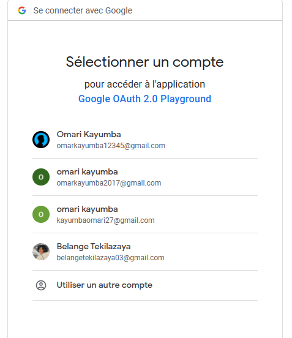

### Dans cette vidéo, nous allons apprendre comment Envoyer un mail à GMAIL via notre application

Sur votre barrse url, entrez http://console.cloud.google.com/
Vous serez envoyé ici, puis cliquer sur le bouton encerclé en rouge

Normalement après voir cliqué, vous serez redirigé vers

Ensuite, encore cliquer sur le bouton encerclé en rouge, et vous serez redirigé sur

Encore cliquer sur le bouton encerclé en route, et vous serez redirigé vers

Ensuite cliquer sur l'icone en rouge, un menu déroulant va s'afficher, puis cliquer sur l'icone en rouge

A ce stade, vous êtes sur le point de choisir le type d'application comme l'indique l'interface ci-dessou

Cliquer sur le menu déroulant et choisissez votre application comme le montre l'interface ci-dessous
Dans notre cas, c'est une application Web

Puis vers le bas, vous cliquez sur CREER, et là un modal va s'afficher, 
ce modal contient votre clé publique et secrète comme le montre l'interface ci-dessous

Copier cela et insérez ça dans votre code

**OAuth 2.0 Playground**
___Après avoir inseré notre API, nous devons faire une deuxième étape___

Allez sur Google et taper ***Google oauth playground*** ou vous pouvez juste entrer ce lien sur la barre de recherche https://developers.google.com/oauthplayground/

Normalement vous serez ci-dessous 

Dans cette interface, il y'a une section ***select the scope***, scroller vers le bas, jusqu'à tomber sur ***Gmail Api V1*** comme l'indique l'interface ci-dessous

Cliquez sur ***Gmail Api V1***, puis ***https://mail.google.com/*** comme l'indique l'interface ci-dessous

En cliquant le button ***Authorize APIS*** qui était bloqué va se débloquer.
Cliquez dessus
Vous serez renvoyez vers une interface de connexion

Et après avoir choisi votre compte de connexion, vous serez renvoyer vers l'interface ci-dessous 

Puis cliquez sur le bouton encerclé en rouge pour generer vos token, et vous obtiendrez ça

**NOTEZ QUE CE TOKEN NE VALIDE QUE PENDANT UNE HEURE ET FAUDRA CONSTAMMENT LE RAFRAICHIR**

